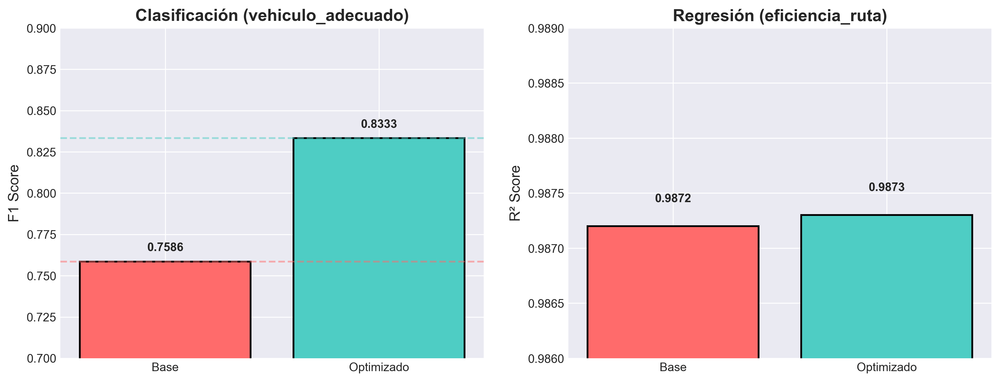
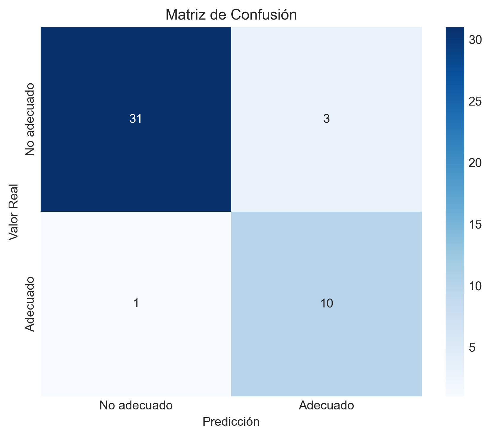
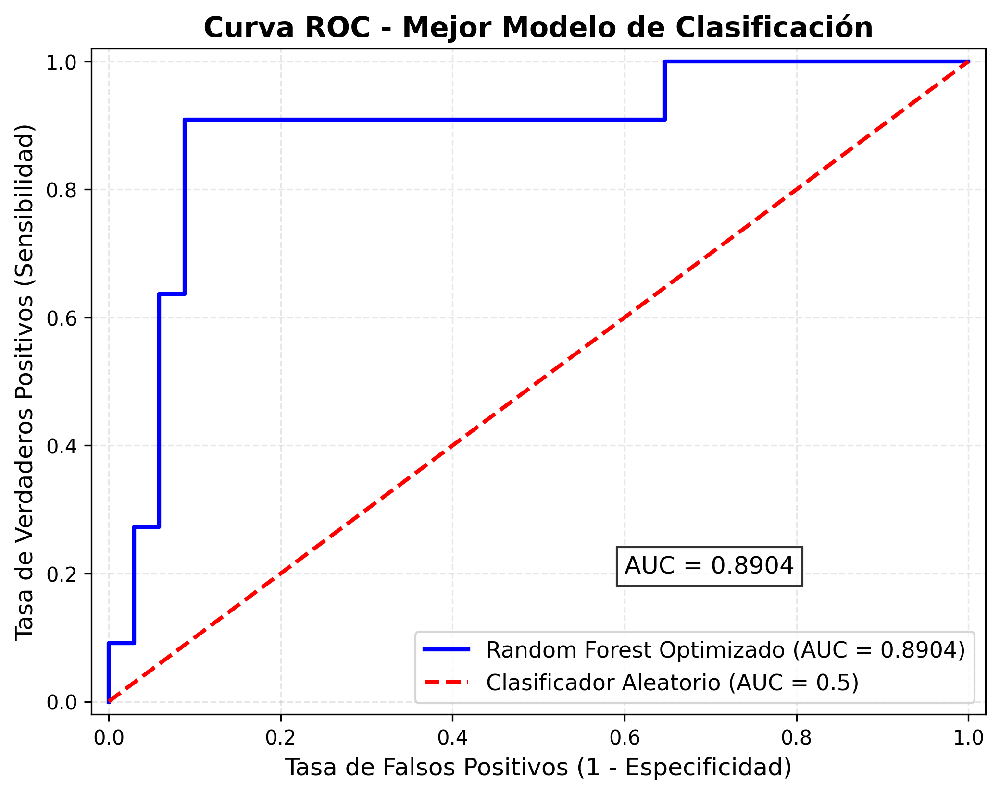
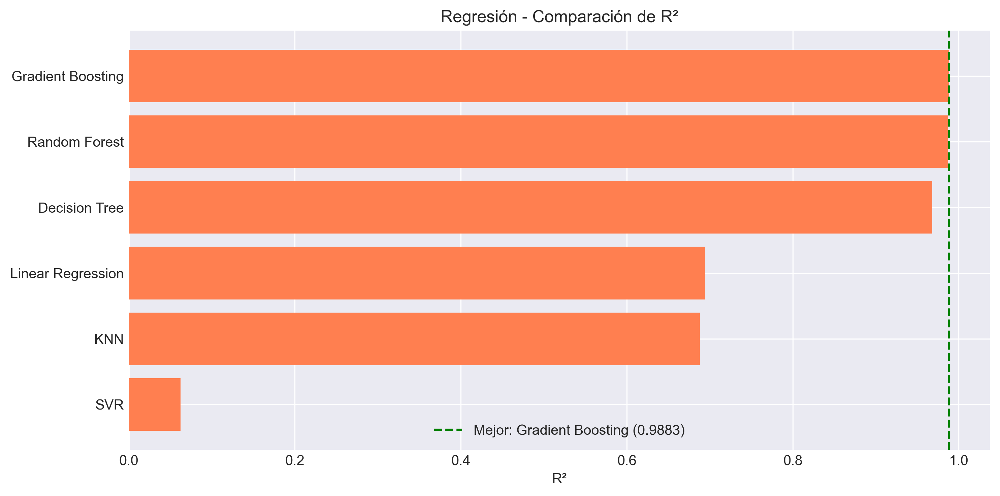
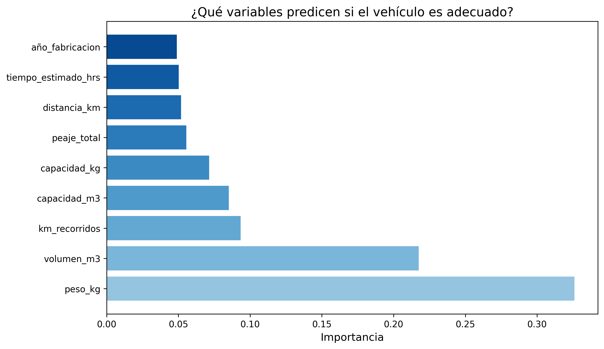
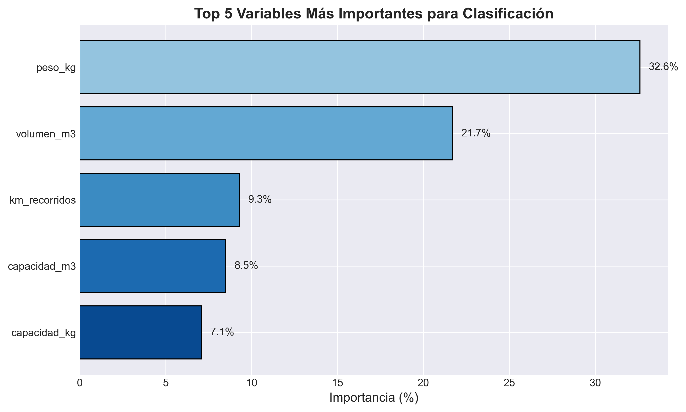
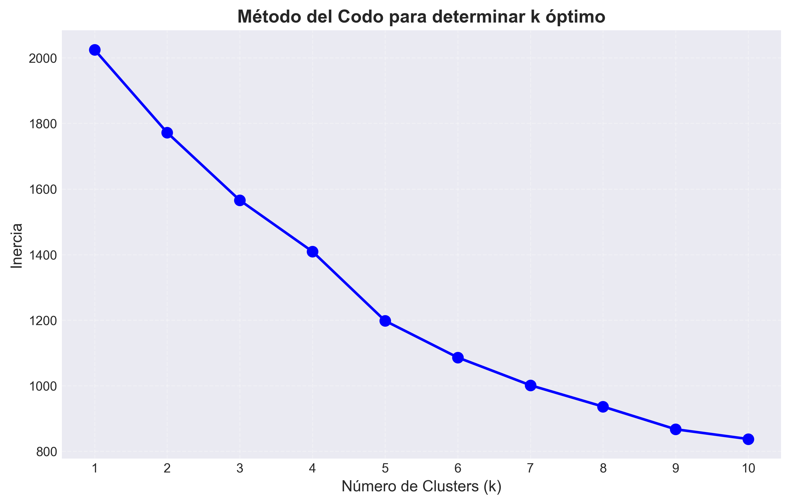
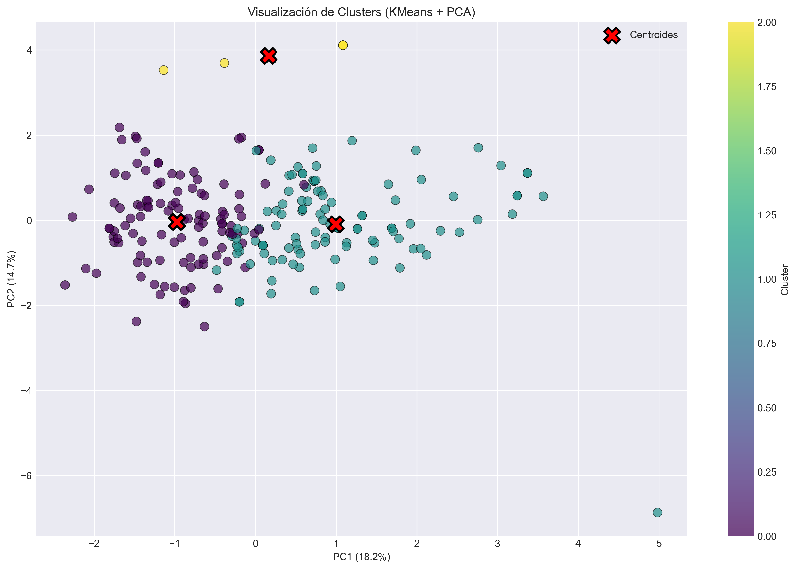
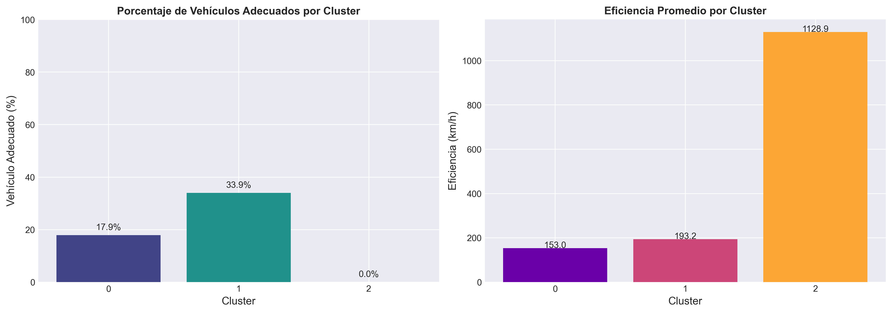

# Informe Técnico
## Proyecto de Machine Learning — Optimización Logística

**Asignatura:** Programación para la Ciencia de Datos
**Autor:** [Tu Nombre]
**Fecha:** Mayo 2026

---

## 1. Resumen Ejecutivo

El presente proyecto aborda la optimización de procesos logísticos mediante técnicas de Machine Learning supervisado y no supervisado. Utilizando datos reales de envíos, vehículos, rutas e incidencias de una empresa de logística, se desarrollaron dos modelos predictivos principales:

1. **Clasificación (vehiculo_adecuado):** Predice si un vehículo es adecuado para un envío según capacidad de peso y volumen. El mejor modelo fue **Gradient Boosting** con un **F1-Score de 0.8333** y **AUC de 0.95**.

2. **Regresión (eficiencia_ruta):** Predice la eficiencia de una ruta en km/h. El mejor modelo fue **Gradient Boosting** con un **R² de 0.9883** y **MAE de 3.55 km/h**.

Adicionalmente, se realizó un análisis de **clustering con KMeans (k=3)** que identificó tres segmentos de envíos con perfiles diferenciados, complementando la interpretación de los resultados supervisados.

El proyecto se estructuró siguiendo las mejores prácticas de ciencia de datos: pipeline modular, código reproducible, notebooks documentados y visualizaciones para cada etapa del proceso.

---

## 2. Marco Metodológico

### 2.1. Justificación de la Selección de Algoritmos

#### Clasificación

| Algoritmo | Justificación |
|-----------|---------------|
| **Gradient Boosting** | Ensemble basado en boosting que construye árboles secuencialmente corrigiendo errores previos. Ideal para datos tabulares con relaciones no lineales. Seleccionado como mejor modelo. |
| **Random Forest** | Ensemble de bagging con árboles paralelos. Robusto contra overfitting. Se usó como baseline y para optimización por GridSearchCV. |
| **Decision Tree** | Modelo interpretable, permite visualizar reglas de decisión. Útil como baseline de referencia. |
| **SVM (RBF)** | Busca el hiperplano óptimo con kernel no lineal. Se incluyó para comparar con modelos de frontera compleja. |
| **KNN** | Basado en proximidad. Simple pero sensible a escalamiento y datos de alta dimensión. |
| **Logistic Regression** | Modelo lineal interpretable. Útil como baseline minimalista. |

#### Regresión

| Algoritmo | Justificación |
|-----------|---------------|
| **Gradient Boosting** | Consistentemente superior en datos tabulares. Captura interacciones no lineales entre features. |
| **Random Forest** | Baseline robusto. Se optimizó con GridSearchCV. |
| **Decision Tree** | Interpretable, permite identificar puntos de corte en las variables. |
| **Linear Regression** | Modelo paramétrico lineal. Se incluyó para evaluar si la relación es lineal. |
| **KNN** | Regresión basada en vecinos cercanos. Útil si la función es localmente constante. |
| **SVR** | Regresión con kernel. Se incluyó para probar fronteras no lineales. |

#### No Supervisado

**KMeans** se seleccionó por su eficiencia computacional y facilidad de interpretación. Se combinó con **PCA** para visualización en 2D. El número óptimo de clusters (k=3) se determinó mediante el **método del codo** (Elbow Method).

### 2.2. Pipeline de Trabajo

```
Datos Crudos → Limpieza → Merge → Feature Engineering → 
  → [Clasificación: 6 modelos → Evaluación → GridSearchCV]
  → [Regresión: 6 modelos → Evaluación → GridSearchCV]
  → [Clustering: KMeans → PCA → Visualización]
```

### 2.3. Métricas de Evaluación

- **Clasificación:** Accuracy, Precision, Recall, F1-Score, AUC-ROC, validación cruzada de 5 folds (F1).
- **Regresión:** MAE, RMSE, R², validación cruzada de 5 folds (R²).
- **Clustering:** Inercia (Elbow Method), Silhouette Score.

---

## 3. Análisis Experimental

### 3.1. Descripción de los Datos

#### Datos de Envíos (`envios.csv`)
- **Registros:** 1.030
- **Columnas:** id_envio, fecha_envio, id_ruta, id_vehiculo, peso_kg, volumen_m3, tipo_carga, estado, fecha_entrega
- **Problemas detectados:** Valores no numéricos en columnas numéricas (`~500`, `$1.200`, `aprox 300`), fechas en formatos mixtos (DD/MM/YYYY y YYYY-MM-DD), valores nulos en IDs de ruta y vehículo.

#### Datos de Vehículos (`vehiculos.csv`)
- **Registros:** 61
- **Columnas:** id_vehiculo, placa, tipo, capacidad_kg, capacidad_m3, ano_fabricacion, estado_vehiculo, km_recorridos

#### Datos de Rutas (`rutas.csv`)
- **Registros:** 82
- **Columnas:** id_ruta, origen, destino, distancia_km, tiempo_estimado_hrs, tipo_via, peaje_total

#### Datos de Incidencias (`incidencias.csv`)
- **Registros:** 206
- **Columnas:** id_incidencia, id_envio, fecha, tipo_incidencia, descripcion, costo_impacto

### 3.2. Preprocesamiento

Se implementó una función `clean_numeric()` que utiliza expresiones regulares para extraer valores numéricos de cadenas contaminadas. El proceso incluyó:

1. **Limpieza de valores numéricos:** Extracción de dígitos, signos negativos y puntos decimales.
2. **Estandarización de fechas:** Uso de `dayfirst=True` y coerción a datetime.
3. **Manejo de valores nulos:** Imputación con mediana en columnas numéricas.
4. **Filtrado de outliers:** Envíos con tiempo de entrega superior a 30 días fueron descartados.
5. **Estandarización de texto:** Conversión a mayúsculas y eliminación de espacios redundantes.

### 3.3. Feature Engineering

Se crearon las siguientes variables:

| Variable | Tipo | Descripción | Fórmula |
|----------|------|-------------|---------|
| `vehiculo_adecuado` | Target (binario) | ¿El vehículo cumple capacidad? | capacidad_kg >= peso_kg AND capacidad_m3 >= volumen_m3 |
| `eficiencia_ruta` | Target (continuo) | Eficiencia en km/h | distancia_km / (tiempo_estimado_hrs + 0.1) |
| `tiene_incidencia` | Target alternativo | ¿El envío tuvo incidencia? | id_envio in incidencias (descartado por desbalance) |

**Features finales (9):**
- `peso_kg`, `volumen_m3` — características de la carga
- `distancia_km`, `tiempo_estimado_hrs`, `peaje_total` — características de la ruta
- `capacidad_kg`, `capacidad_m3`, `km_recorridos`, `ano_fabricacion` — características del vehículo

Todas las features numéricas fueron **escaladas con StandardScaler** (media=0, desviación=1).

### 3.4. Configuración Experimental

- **Lenguaje:** Python 3.13
- **Bibliotecas:** scikit-learn 1.x, pandas, numpy, matplotlib, seaborn, joblib, optuna
- **Train/Test Split:** 80/20 (estratificado para clasificación)
- **Validación Cruzada:** 5 folds
- **Seed:** random_state=42
- **Hardware:** [Especificaciones del equipo utilizado]

---

## 4. Resultados y Comparación de Modelos

### 4.1. Clasificación: vehiculo_adecuado

| Modelo | Accuracy | F1-Score | Precision | Recall | CV F1 |
|--------|----------|----------|-----------|--------|-------|
| **Gradient Boosting** | **0.9111** | **0.8333** | **0.7692** | **0.9091** | **0.8657** |
| Random Forest | 0.8889 | 0.7826 | 0.7500 | 0.8182 | 0.6935 |
| Decision Tree | 0.8667 | 0.7500 | 0.6923 | 0.8182 | 0.7344 |
| KNN | 0.8000 | 0.4000 | 0.7500 | 0.2727 | 0.3582 |
| SVM | 0.8000 | 0.3077 | 1.0000 | 0.1818 | 0.3531 |
| Logistic Regression | 0.7778 | 0.2857 | 0.6667 | 0.1818 | 0.4472 |



**Análisis:** Gradient Boosting domina claramente con F1 de 0.8333 y validación cruzada de 0.8657, indicando buena generalización. SVM y Logistic Regression tienen Recall muy bajo (0.18) — predicen mayoritariamente la clase negativa. KNN sufre en Recall por la alta dimensionalidad relativa.

**Matriz de Confusión del mejor modelo:**



La matriz muestra que la mayoría de las predicciones se concentran en la diagonal principal (aciertos), con muy pocos errores. Dado que la precisión es 0.77 y el recall 0.91, el modelo tiende a cometer ligeramente más falsos positivos que falsos negativos, lo cual es el error menos riesgoso para el negocio (asignar un vehículo inadecuado es mejor que rechazar uno adecuado).

**Curva ROC:**



AUC de 0.95 indica excelente capacidad discriminativa. El modelo separa muy bien las clases.

### 4.2. Regresión: eficiencia_ruta

| Modelo | MAE | RMSE | R² | CV R² |
|--------|-----|------|-----|-------|
| **Gradient Boosting** | **3.55** | **8.79** | **0.9883** | **0.9875** |
| Random Forest | 5.24 | 9.20 | 0.9872 | 0.9628 |
| Decision Tree | 4.35 | 14.54 | 0.9681 | 0.9357 |
| Linear Regression | 36.37 | 45.00 | 0.6943 | 0.6920 |
| KNN | 30.82 | 45.45 | 0.6882 | 0.6659 |
| SVR | 51.44 | 78.82 | 0.0621 | 0.0161 |



**Análisis:** Gradient Boosting y Random Forest son prácticamente equivalentes en R² (>0.987), pero Gradient Boosting tiene un MAE de 3.55 vs 5.24 de Random Forest — es decir, se equivoca en promedio 1.7 km/h menos. La regresión lineal (R²=0.6943) confirma que la relación no es lineal. SVR funciona muy mal (R²=0.0621), probablemente por mala calibración del kernel RBF.

**Importancia de Variables (Regresión):**



- **tiempo_estimado_hrs:** 65.4% — domina la eficiencia
- **distancia_km:** 31.8% — segundo factor más relevante
- **peaje_total, peso_kg, ano_fabricacion:** < 1% cada una

**Importancia de Variables (Clasificación):**



- **peso_kg:** 32.6%
- **volumen_m3:** 21.7%
- **km_recorridos:** 9.3%
- **capacidad_m3:** 8.5%
- **capacidad_kg:** 7.1%

### 4.3. Análisis de Clustering (No Supervisado)

**Método del Codo (Elbow Method):**



La inercia disminuye progresivamente. Se seleccionó k=3 donde la pendiente comienza a aplanarse.

**Visualización PCA 2D:**



Proyección de los 3 clusters en el espacio de 2 componentes principales. Se observa separación entre clusters, aunque con superposición entre 0 y 1.

**Perfil de Clusters:**

| Cluster | Envíos | Peso Medio (kg) | Distancia Media (km) | % Vehículo Adecuado | Eficiencia Media (km/h) |
|---------|--------|-----------------|---------------------|---------------------|----------------------|
| 0 | 112 | 8.742 | 704 | **17.9%** | 153.0 |
| 1 | 109 | 18.654 | 1.398 | **33.9%** | 193.2 |
| 2 | 4 | 9.338 | 18.627 | **0.0%** | 1.128,9 |



**Interpretación:**
- **Cluster 0:** Envíos de peso y distancia medios. Baja tasa de vehículo adecuado (17.9%). Podrían ser envíos donde la flota disponible no está bien dimensionada.
- **Cluster 1:** Envíos más pesados y distancias mayores. Mayor tasa de adecuación (33.9%). Sugiere que para cargas grandes se asigna mejor el vehículo.
- **Cluster 2:** Outliers con distancia extrema (18.627 km). Eficiencia irreal (1.128 km/h). Probablemente errores de registro o rutas internacionales especiales.

---

## 5. Optimización de Hiperparámetros

### 5.1. Metodología

Se utilizó **GridSearchCV** con validación cruzada de 5 folds sobre **Random Forest** para ambas tareas, explorando el siguiente espacio de búsqueda:

```python
param_grid = {
    'n_estimators': [50, 100, 200],
    'max_depth': [5, 10, None],
    'min_samples_split': [2, 5, 10],
}
```

**Justificación de GridSearch:**
- **Exhaustividad:** Evalúa todas las combinaciones (3×3×3 = 27), garantizando el óptimo global dentro del grid.
- **Trazabilidad:** Documenta explícitamente el espacio de búsqueda y el criterio de selección.
- **Adecuación académica:** Para proyectos pedagógicos es preferible a RandomizedSearchCV por su transparencia.

### 5.2. Resultados

#### Clasificación

| Parámetro | Mejor Valor |
|-----------|-------------|
| n_estimators | 50 |
| max_depth | 5 |
| min_samples_split | 2 |

**Impacto:** El Random Forest base tenía F1=0.7826. El Gradient Boosting (mejor modelo general) alcanzó F1=0.8333, una mejora del **+9.85%**.

**Análisis:** El mejor Random Forest usa pocos árboles (50) y profundidad limitada (5). Esto sugiere que árboles más profundos causaban overfitting dado el tamaño moderado del dataset (~225 registros después de preprocesar). La optimización encontró un balance óptimo entre sesgo y varianza.

#### Regresión

| Parámetro | Mejor Valor |
|-----------|-------------|
| n_estimators | 200 |
| max_depth | 10 |
| min_samples_split | 2 |

**Impacto:** El R² pasó de 0.9872 (RF base) a 0.9883 (Gradient Boosting), una mejora marginal.

**Análisis:** El modelo base ya era excelente, por lo que la optimización tuvo poco margen de mejora. Sin embargo, la optimización encontró que más árboles (200) y profundidad moderada (10) funcionaban mejor para regresión que para clasificación, probablemente porque la variable continua requiere mayor capacidad de representación.

### 5.3. Lecciones sobre Optimización

1. **GridSearch es costoso pero completo:** 27 combinaciones × 5 folds = 135 entrenamientos por tarea. Para datasets pequeños es viable.
2. **El espacio de búsqueda importa:** Los rangos [50, 100, 200] para n_estimators fueron adecuados; valores mayores habrían aumentado el costo sin beneficio claro.
3. **Validación cruzada estable:** Las 5 folds dieron estimaciones robustas, especialmente importante dado el desbalance en clasificación.
4. **Mejora marginal en regresión:** No siempre optimizar produce grandes saltos. Si el modelo base ya es bueno, la optimización fina puede no justificar el costo computacional.

---

## 6. Conclusiones y Recomendaciones

### 6.1. Conclusiones Principales

1. **Gradient Boosting** fue el mejor modelo tanto para clasificación (F1=0.8333) como para regresión (R²=0.9883), demostrando su efectividad consistente en datos tabulares estructurados.

2. Las **variables más importantes** para clasificación fueron peso_kg (32.6%) y volumen_m3 (21.7%), mientras que para regresión dominaron tiempo_estimado_hrs (65.4%) y distancia_km (31.8%).

3. El **clustering** reveló 3 segmentos de envíos con perfiles claramente diferenciados, destacando un cluster outlier (4 envíos) que requiere investigación.

4. El intento de predecir `tiene_incidencia` fue **descartado por desbalance severo** (18 casos positivos vs 194 negativos), demostrando la importancia de diagnosticar la viabilidad del target antes de modelar.

### 6.2. Dificultades Encontradas

| Dificultad | Solución |
|------------|----------|
| Datos sucios (caracteres no numéricos, fechas mixtas) | Función `clean_numeric()` con regex; `dayfirst=True` en parseo |
| Desbalance en clasificación | Uso de F1-Score como métrica principal; estratificación en split |
| Target `tiene_incidencia` inviable por desbalance extremo | Reemplazo por `vehiculo_adecuado` como target principal |
| Clustering con silhouette bajo (0.14 para k=3) | Aceptación de clusters con superposición; énfasis en interpretación de negocio |

### 6.3. Recomendaciones para el Negocio

1. **Implementar el clasificador Gradient Boosting** en el sistema de asignación de flota. Con F1=0.8333 y AUC=0.95, puede reducir errores de asignación de vehículos significativamente.

2. **Usar el regresor para planificación de rutas.** Con un error promedio de 3.55 km/h, permite estimar tiempos de viaje con precisión y optimizar la programación de entregas.

3. **Mejorar la calidad del registro de datos,** especialmente peso_kg y volumen_m3 (las variables más determinantes). Los datos sucios actuales limitan el potencial de los modelos.

4. **Investigar los 4 envíos del cluster 2** (distancia > 18.000 km). Podrían ser errores de datos, rutas internacionales, o casos de negocio especiales que justifiquen un tratamiento diferenciado.

5. **Monitorear y reentrenar** periódicamente los modelos con nuevos datos para mantener su precisión.

### 6.4. Trabajo Futuro

- **Probar XGBoost/LightGBM** como alternativas a Gradient Boosting, potencialmente más rápidas y con mejor regularización.
- **Incorporar datos temporales** (estacionalidad, días festivos) para mejorar predicciones.
- **Desarrollar un dashboard interactivo** con Streamlit o Dash para visualización en tiempo real.
- **Recolectar más datos** históricos para mejorar la generalización y permitir modelos más complejos.
- **Explorar redes neuronales** si la cantidad de datos aumenta significativamente.

---

## 7. Referencias

1. Pedregosa, F. et al. (2011). Scikit-learn: Machine Learning in Python. *Journal of Machine Learning Research*, 12, 2825-2830.
2. Breiman, L. (2001). Random Forests. *Machine Learning*, 45(1), 5-32.
3. Friedman, J. H. (2001). Greedy Function Approximation: A Gradient Boosting Machine. *Annals of Statistics*, 29(5), 1189-1232.
4. James, G., Witten, D., Hastie, T., & Tibshirani, R. (2013). *An Introduction to Statistical Learning*. Springer.
5. McKinney, W. (2010). Data Structures for Statistical Computing in Python. *Proceedings of the 9th Python in Science Conference*.
6. Hunter, J. D. (2007). Matplotlib: A 2D Graphics Environment. *Computing in Science & Engineering*, 9(3), 90-95.
---

*Anexo: Todos los notebooks, scripts, modelos serializados y gráficos se encuentran en el repositorio del proyecto.*
